# FLYWHEEL PIPELINE: BIDS + FMRIPREP

## 1. Data from the Zuckerman scans should be automatically uploaded to Flywheel
a. Check to make sure that all of your data is uploaded
- If there are any issues, contact [Jonathan Cardona](jc5724@columbia.edu)

## 2. Check to make sure that the data looks good

a. Check to make sure that dicom classifier & dcm2niix ran properly
- Sessions tab -> Provenance
- Data should already be in Nifti (.nii) format. 

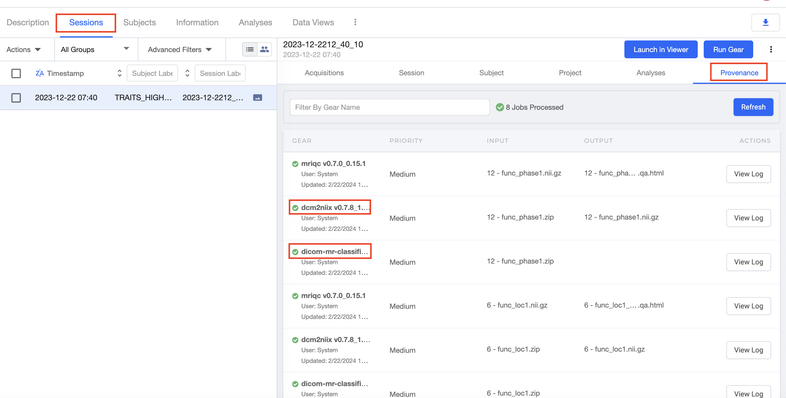

b. If there is pilot data, ignore it:

- Sessions &rarr; Select Sub on left &rarr; Session &rarr; Custom Information &rarr; BIDS &rarr; ignore &rarr; Save
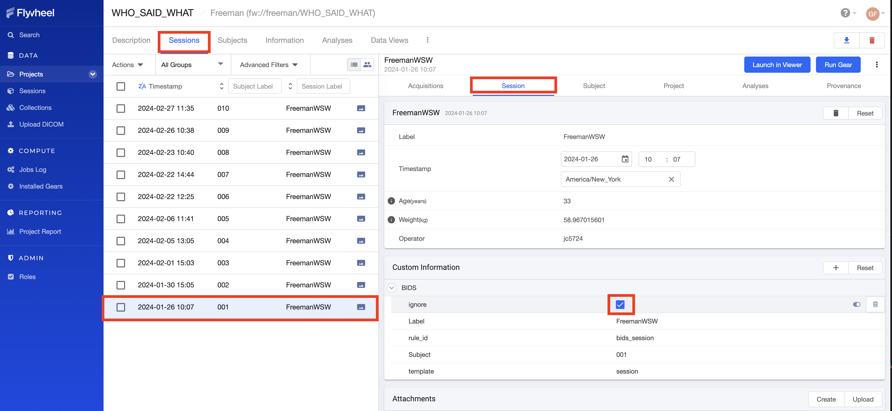

c. Check to make sure acquisitions are scanned correctly:

- Sessions -> Acquisitions -> Classification column

 Make sure the functional images are classified as **MR: Functional, T2***

 .jpg)

.jpg)

d. Back up the data and then remove any extra runs that were collected
- Operator should have taken logs of the actual fMRI scan - follow those notes for what to remove
  - Eg: if the trigger didn't go off and had to rerun that run

(1) Backup data in case: Session tab -> Acquisitions -> 3 dots on right -> Download Acquisition Files -> Select: All -> Download

.jpg)

(2) Remove: Session tab -> Acquisitions -> 3 dots on right -> Delete Session -> Yes
- Make sure it is backed up (1) before you delete it! 

.jpg)

## 3. BIDS pre-curation at project level

a. Run the BIDS Pre-Curation gear at the project level:
- Analyses tab &rarr; "Run Analysis Gear"

.jpg)

- Select BIDS Pre-Curation &rarr; Press "Run Gear"

.jpg)

b. After the bids-pre-curate gear finishes running (~2mins), download the 3 files that you get from that analysis gear:
- Analysis tab &rarr; Find bids-pre-curate you just ran &rarr; click 3 buttons on the right &rarr; “Download Files”

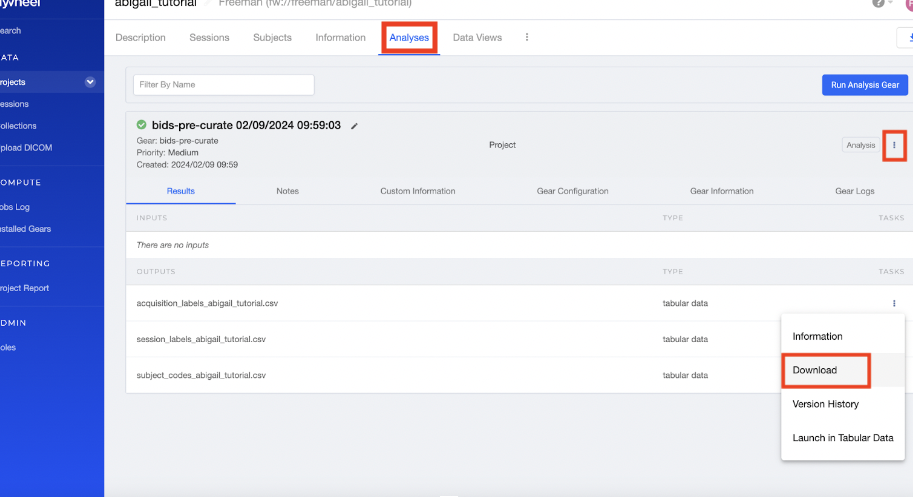

c. You **ONLY** need to edit the **acquisition_labels....csv**:

- Only worry about the **new_acquisition_label** column

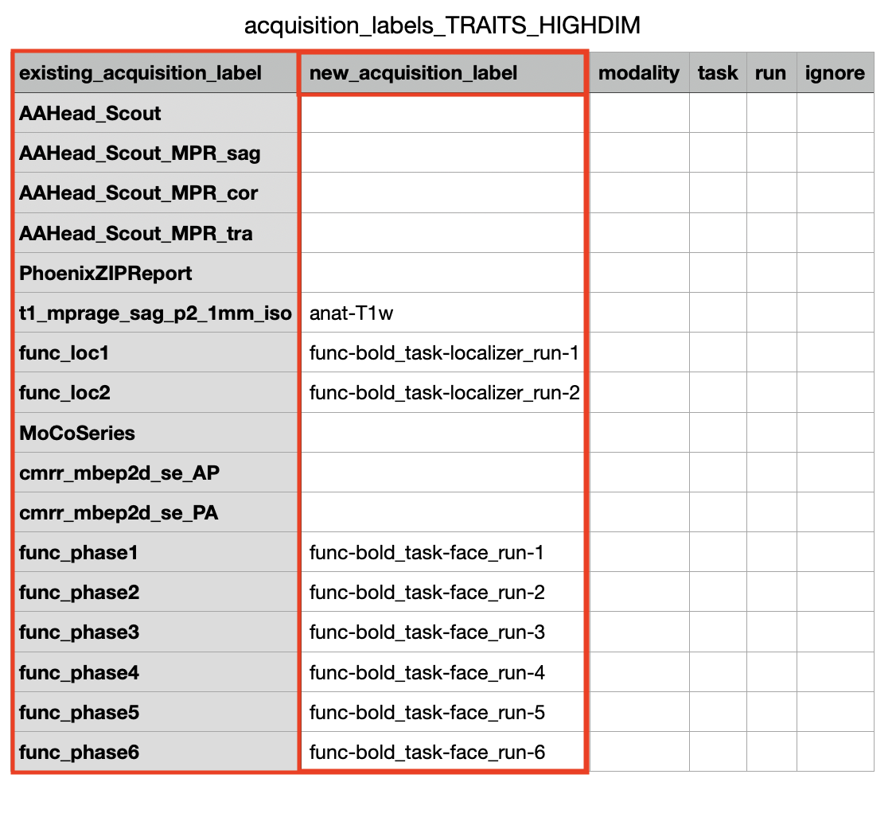
- Only add names for files that you care about
  - Eg: we only use anat and funcs 
    - You might also wanna use the field maps, but fMRIPrep on FW does not seem to use them...   
- Use the example above and the  [Bids Study Design Spreadsheet](https://docs.google.com/spreadsheets/d/1DdNVY99udc8NeYpMS_ogAg19FZgkISkP/edit#gid=1495259008) to see how you should rename the files

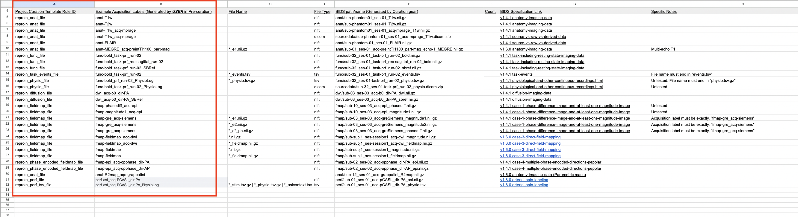

- Eg: t1_mprage_sag_p2_1mm_iso &rarr; anat_T1w
- Eg: func_phase1 &rarr; func-bold_task-faces_run-01

d. Upload the 3 csvs to the the project level
- Information &rarr; Attachments &rarr; Upload

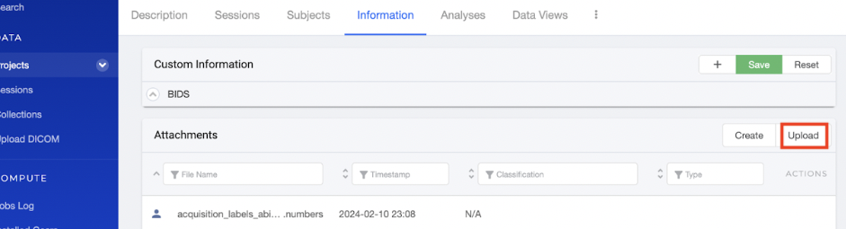

## 4. Rerun the BIDS precuration with the spreadsheet inputs specified

a. Rerun BIDS Pre-Curation at the project level

- Analyses tab &rarr; "Run Analysis Gear"

.jpg)

b. This time, reupload the edited files (3 csvs) from [Step 3](#3-bids-pre-curation-at-project-level)

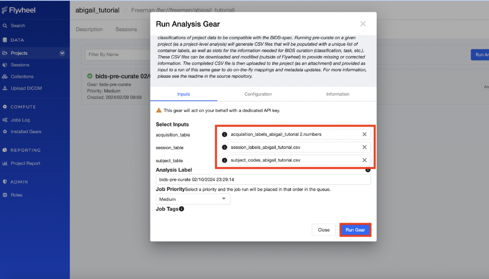

c. After running (~2mins), check to make sure the acquisition label headers are correct
- Sessions &rarr; Acquisitions &rarr; look at grayed out headers
- Eg: func_phase1 &rarr; func-bold_task-faces_run-01

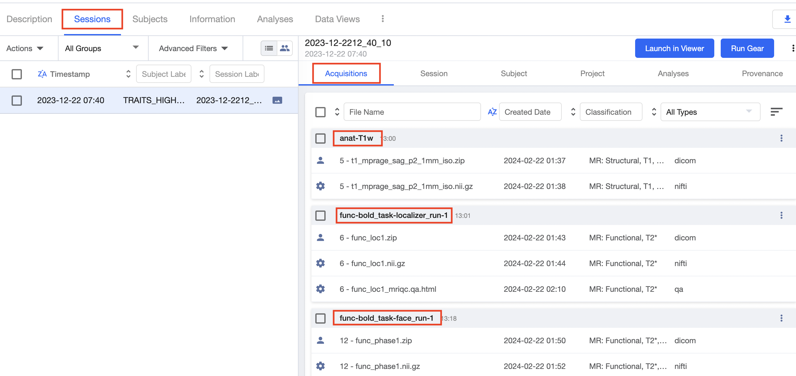

## 5. Run BIDS curation at project level

a. Run BIDS Curation gear
- Analyses tab &rarr; "Run Analysis Gear"

.jpg)

- Select BIDS Curation gear &rarr; Press "Run Gear"
- Takes about 2 minutes to run

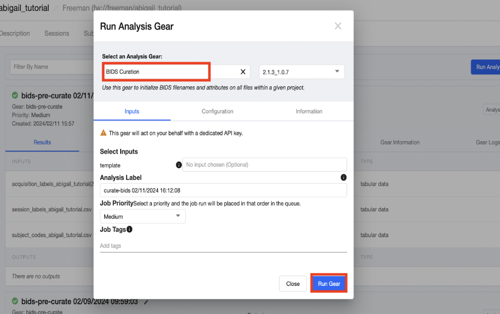

b. Check to make sure everything ran correctly

- Sessions &rarr; 3 dots all the way right &rarr; toggle BIDS View on

- Even if this doesn't look like BIDS format... might still be okay
  - Check the ..._niftis.csv from the curate-bids gear output
    - Analyses &rarr; curate-bids gear &rarr; Results &rarr; 3 dots on the right &rarr; Download **..._niftis.csv**
  
.jpg)
- The Curated BIDS path column in the ..._niftis.csv should have the right BIDS strucutre (anat, func, file names, etc...)

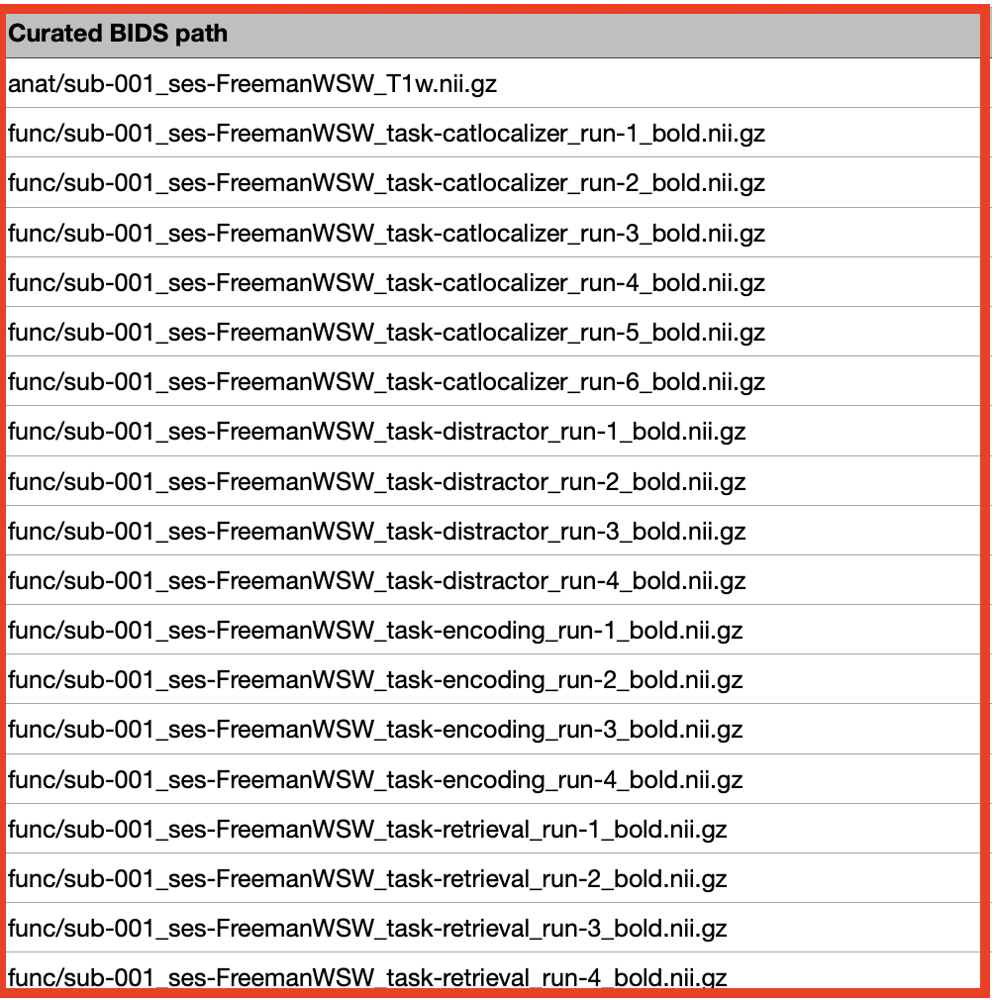

c. If there is an error, check the gear log
- Analyses &rarr; curate-bids gear &rarr; Gear logs

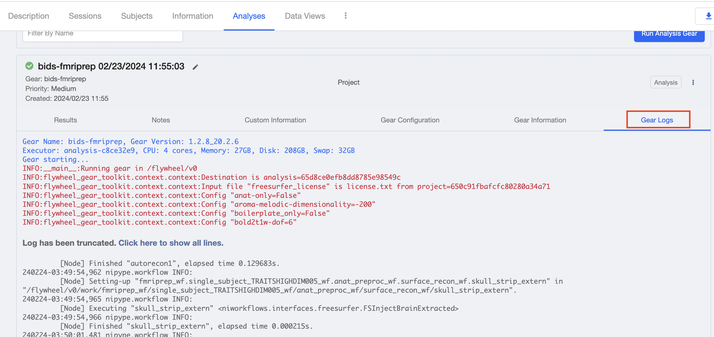

 - download files from the gear, and check the …acqusitions.csv for errors

## 6. Run BIDS fMRIPrep at the subject level

a. Download the Free Surfer License
- Follow the steps on this [link](https://surfer.nmr.mgh.harvard.edu/fswiki/License) to download the Free Surfer License, save it as a .txt file

b. Upload the Free Surfer License to the project level 
- Information &rarr; Attachments &rarr; Upload

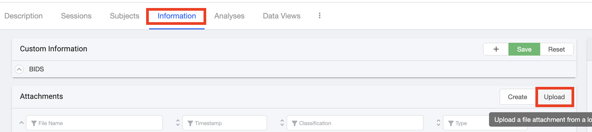

c. Run the BIDS fMRIPrep Gear at the **subject level**
- Needs to be run individually for each subject
- Sessions &rarr; Select desired subject on the left (002 in the example below) &rarr; Analyses &rarr; Press "Run Analyses Gear" on the right

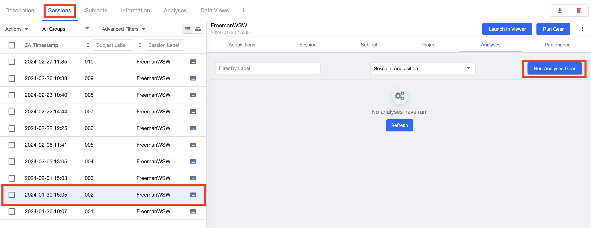

- Select BIDS fMRIPrep gear &rarr; Upload the license.txt file

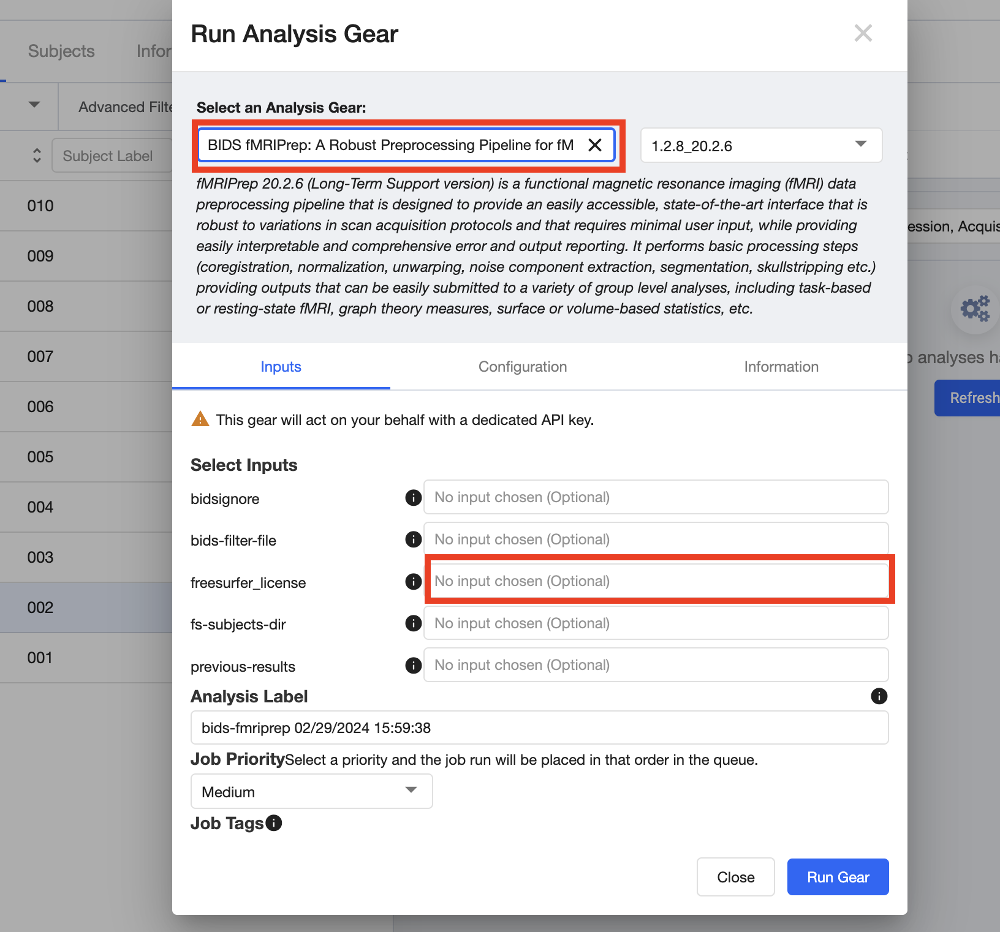

- The only thing you need to upload is the license.txt that you downloaded from step 6a
  - It is a bit tricky to upload... you need to go back to the project level, then find the license and select it

.jpg)
.jpg)

- After uploading the licsense.txt, press "Run Gear" 

.jpg)

- It takes a long time to run!

d. Note: if voxel sizes are different across subjects due to data collection error, you want to make them them all be in the same space... 

- Configuration -> output-spaces -> change to MNI152NLin2009cAsym:res-2

.jpg)

.jpg)

## 7. Download the BIDS-fMRIPrep output at the subject level 

a. Download the bids-fmriprep output at the **subject level**
- Needs to be downloaded individually for each subject
- Sessions &rarr; Select desired subject (001 in the example below) &rarr; Analyses &rarr; bids-fmriprep &rarr; 3 dots on right &rarr; Download Files Press

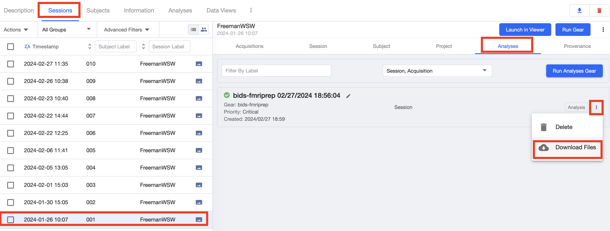

b. Check the gear logs for any errors

- Sessions &rarr; Select desired subject (001 in the example below) &rarr; Analyses &rarr; Gear Logs

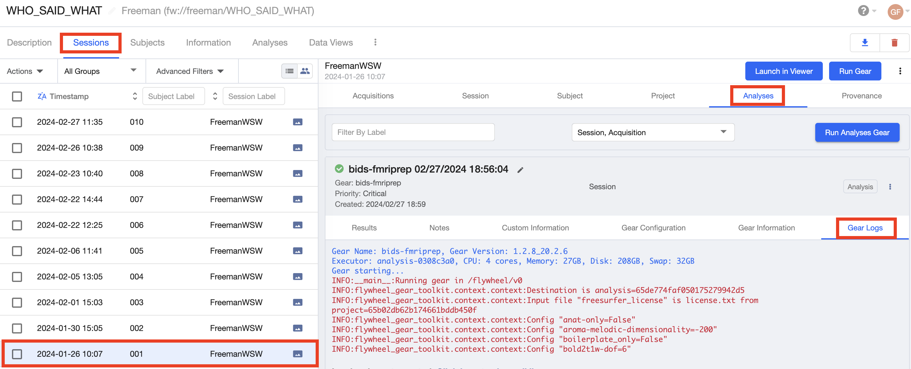
